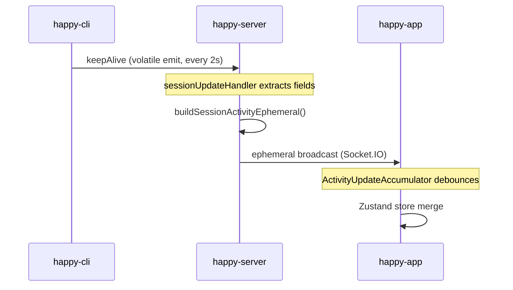
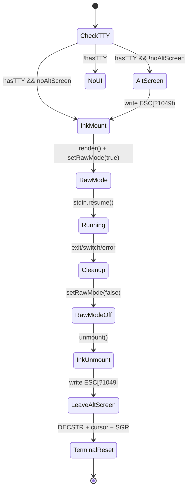

# Cross-Stack Feature Implementation: Patterns & Lessons

This document captures architectural patterns, pitfalls, and optimization strategies discovered during a cross-stack feature sprint covering CLI, Server, and App. The sprint included: ephemeral data pipeline extensions, UI component consolidation, bidirectional state synchronization, and terminal lifecycle management.

## 1. Ephemeral Data Pipeline (CLI → Server → App)

### Architecture



### How to extend the pipeline

Adding a new field to the ephemeral activity stream requires changes in **7 layers**:

| Layer | File | What to do |
|-------|------|------------|
| 1. CLI emit | `happy-cli/src/api/apiSession.ts` | Add field to `keepAlive()` emit payload |
| 2. CLI types | `happy-cli/src/api/types.ts` | Extend `session-alive` event type |
| 3. Server handler | `happy-server/.../sessionUpdateHandler.ts` | Destructure new field, pass to builder |
| 4. Server builder | `happy-server/.../eventRouter.ts` | Add field to `buildSessionActivityEphemeral()` params and return |
| 5. App schema | `happy-app/.../sync/apiTypes.ts` | Add to `ApiEphemeralActivityUpdateSchema` |
| 6. App store | `happy-app/.../sync/storageTypes.ts` | Add to `Session` interface |
| 7. App reducer | `happy-app/.../sync/sync.ts` | Copy field in `flushActivityUpdates()` |

**Key rule**: The `ActivityUpdateAccumulator` only flushes immediately for "significant" changes. If a new field should trigger immediate flush (like permission mode), add change detection logic to `addUpdate()`. Otherwise it debounces on the 500ms timer.

### Currently transported fields

| Field | Type | Significant? | Description |
|-------|------|:---:|-------------|
| `active` | `boolean` | Yes | Whether CLI is alive |
| `thinking` | `boolean` | Yes | Claude is generating a response |
| `compressing` | `boolean` | Yes | Context compression in progress (manual `/compact` or auto-compression) |
| `hud` | `SessionHudData` | Yes (JSON diff) | Model, context %, tokens, cost — captured via statusLine wrapper |

### Pitfall: Server timeout calls

`happy-server/.../presence/timeout.ts` also calls `buildSessionActivityEphemeral()`. When adding new parameters, pass `undefined` there — timeouts don't carry live data.

### Compression State Detection

Two triggers set `compressing = true`:

1. **Manual `/compact`**: Detected in `claudeRemote.ts` when `specialCommand.type === 'compact'`. Cleared when the result message arrives.
2. **Auto-compression**: Claude Code forks the session when context is near-full. Detected by counting `system.init` messages — a second `init` during the same query indicates a session fork (auto-compression). Cleared on the subsequent `result` message.

### HUD Data Pipeline (statusLine → keepAlive)

HUD data flows through a file-based side channel rather than the SDK event stream:

```
Claude Code statusLine stdin (JSON)
  → statusLineWrapper.ts (captures + writes /tmp/happy-hud-{sessionId}.json)
    → Session.readHudFile() (every 2s keepAlive tick)
      → keepAlive({ hud: hudData })
        → Server → App (normal ephemeral pipeline)
```

The wrapper is configured in `generateHookSettings.ts` as the session's `statusLine` command. If the user has their own `statusLine` command (read from `~/.claude/settings.json` or `settings.local.json`), the wrapper chains to it via `HAPPY_ORIGINAL_STATUSLINE` env var — user's command still runs and receives the same stdin.

**HUD fields**: `model`, `contextPercent`, `contextTokens`, `contextMax`, `costUsd`.

## 2. Permission Mode Synchronization

### State Priority System

```
CLI local mode  → CLI state is authoritative
                → keepAlive reports CLI state → App displays it passively

CLI remote mode → App selections take priority
                → Change sent in encrypted message meta
                → CLI picks up at turn boundary (mode hash change → SDK restart)
                → During transition: badge shows "ModeName (cli:currentMode)"
```

### Turn Boundary Restart Mechanism

Permission mode changes cannot be applied mid-conversation because `--dangerously-skip-permissions` is a **startup parameter**. The actual mechanism:

1. App sends `permissionMode` in encrypted message `meta`
2. CLI's `runClaude.ts` extracts it in `onUserMessage`, updates `currentPermissionMode`
3. `EnhancedMode` hash changes (includes full `permissionMode`, model, tools, etc.)
4. `MessageQueue2.waitForMessagesAndGetAsString()` returns message with new hash
5. `claudeRemoteLauncher.nextMessage()` detects hash mismatch → returns `null`
6. Current `claudeRemote()` query ends gracefully
7. Loop iteration restarts with new mode → new Claude SDK process spawns

**Critical**: Never try to change permission mode mid-query. The SDK process must terminate and restart.

**Hash includes full permissionMode**: The mode hash uses `permissionMode: mode.permissionMode` (not `isPlan: boolean`), so switching between any modes (e.g., `default` → `yolo`) triggers a restart. See `yolo-mode-investigation.md` for the fix rationale.

### Plan Mode Restoration

When entering plan mode, `PermissionHandler` saves the current mode as `prePlanMode`. On ExitPlanMode approval, it restores the pre-plan mode rather than falling back to `default`. This preserves yolo mode across plan mode cycles.

Saving happens in `handleModeChange()` (on entry to plan), not in `handleToolCall()` (on ExitPlanMode) — by the time ExitPlanMode is called, `permissionMode` has already been overwritten to `'plan'`. See `yolo_problem.md` for the detailed fix.

### Default Startup Mode

CLI auto-appends `--dangerously-skip-permissions` when no explicit permission flag is provided. This ensures remote mode always works (Claude can execute tools without terminal prompts). Check happens in `index.ts` after argument parsing:

```ts
const hasExplicitPermFlag = allClaudeArgs.some((a: string) =>
    a === '--dangerously-skip-permissions' || a === '--permission-mode' || a.startsWith('--permission-mode='));
if (!hasExplicitPermFlag) {
    options.claudeArgs = [...allClaudeArgs, '--dangerously-skip-permissions'];
}
```

## 3. UI Component Consolidation Strategy

### When to merge vs. keep separate

Merged the standalone `SessionHudBar` into `AgentInput`'s status bar because:
- HUD data (model, context%, tool count) is semantically part of session status
- Separate bar consumed vertical space on mobile
- Data source (`session.hud`) was already available in the same view

**Pattern**: If a component displays < 4 data points and lives adjacent to an existing status bar, merge it as inline segments rather than keeping a separate component.

### Inline HUD Segments

```tsx
{hudData.model && (
    <Text style={{ fontSize: 11, color: theme.colors.textSecondary, ...Typography.mono() }}>
        {hudData.model}
    </Text>
)}
{hudData.contextPercent !== undefined && (
    <Text style={{ fontSize: 11, color: contextPercentColor, ...Typography.mono() }}>
        {Math.round(hudData.contextPercent)}%
    </Text>
)}
```

**Context % color thresholds**: `<50` green, `50-80` warning, `>=80` destructive. These match the CLI's own context warning levels.

## 4. i18n Workflow

### Type Source Chain

```
_default.ts  (type source, inferred via `satisfies`)
    ↓
translations/*.ts  (must match _default.ts structure exactly)
```

**Pitfall**: Adding keys only to translation files causes no TypeScript error (they use `satisfies`), but the keys won't exist in the inferred type. Always add new keys to `_default.ts` first, then to all translation files.

### Checklist for new translatable strings

1. Add keys to `sources/text/_default.ts` (this defines the type)
2. Add to `sources/text/translations/en.ts`
3. Add to all 8 other language files: `zh-Hans`, `zh-Hant`, `ru`, `ja`, `es`, `pt`, `it`, `pl`, `ca`
4. Run `yarn typecheck` — missing keys in any file will produce a type error

## 5. Terminal Lifecycle Management (Remote Mode)

### Remote Color Suppression

By default, remote mode spawns Claude Code with color/emoji output suppressed to prevent ANSI escape sequences from corrupting the message stream. Implemented via environment variables injected through `QueryOptions.env`:

```
NO_COLOR=1  FORCE_COLOR=0  TERM=dumb
```

These are set in `claudeRemote.ts` and propagated through `sdk/query.ts` to the child process without mutating the parent `process.env`. The `--remote-color` CLI flag overrides this to keep color output (useful for debugging).

### Alternate Screen Buffer

Remote mode enters the terminal's alternate screen buffer (`\x1b[?1049h`) before mounting Ink. This isolates all remote mode rendering from local mode's terminal history — when returning to local mode, the previous terminal content is restored via `\x1b[?1049l`. The `--no-alt-screen` flag disables this behavior.

### State Machine



### Terminal Reset Sequence

After leaving alt screen, apply a soft reset to fix leftover state from Ink:

```ts
// DECSTR (soft reset) + show cursor + reset SGR attributes
process.stdout.write('\x1b[!p\x1b[?25h\x1b[0m');
```

Why each escape:
- `\x1b[!p` — DECSTR: soft terminal reset (resets modes without clearing screen)
- `\x1b[?25h` — show cursor (Ink may leave it hidden)
- `\x1b[0m` — reset all SGR attributes (colors, bold, etc.)

### Cleanup Order Matters

1. `setRawMode(false)` — must happen before unmount to avoid stdin issues
2. `stdin.resume()` — ensure stdin is flowing after raw mode change
3. `inkInstance.unmount()` — clean up React tree
4. Leave alt screen (`\x1b[?1049l`) — restore previous terminal content
5. Terminal reset (`DECSTR + cursor + SGR`) — clean up any residual state

Reversing steps 1 and 3 can cause the terminal to hang (Ink tries to write to a non-raw stdin).

### Debug Logging

Set `HAPPY_TERMINAL_DEBUG=1` to create `/tmp/happy-terminal-debug-{pid}.log` with timestamped entries at each state transition. Use `scripts/test-terminal.sh` to automate before/after comparison of `stty` settings.

## 6. Settings Extension Pattern

### Adding a new settings field (`persistence.ts`)

1. Add the field to the `Settings` interface (use optional `?` for backward compat)
2. No need to touch `defaultSettings` — missing fields default to `undefined`
3. No schema migration needed for additive optional fields
4. Access via `readSettings()` in consumers

Example: `remoteTerminal?: { suppressEmoji?: boolean; forceNoColor?: boolean }`

### Environment Variable Propagation

To pass settings as env vars to a spawned process:

```
Settings (persistence.ts)
  → readSettings() in runClaude.ts
    → loop() options
      → Session constructor field
        → claudeRemoteLauncher reads from session
          → claudeRemote() env config
            → Claude SDK process.env
```

This is 6 layers deep. Consider whether the setting truly needs to reach the child process, or if it can be handled at a higher layer.

## 7. Accumulator / Debounce Pattern

The `ActivityUpdateAccumulator` demonstrates a useful pattern for real-time data:

- **Significant changes** (state transitions, new data types): flush immediately
- **Minor updates** (timestamp-only heartbeats): debounce with timer
- **Timer doesn't reset**: once started, the debounce timer fires at its original deadline even if more updates arrive. This prevents starvation under high-frequency updates.
- **Batching**: all pending updates flush together in one callback, reducing the number of re-renders.

### When to mark a change as "significant"

Add to the `isSignificantChange` check when:
- The field represents a user-visible state change (e.g., thinking → not thinking, compressing → done)
- Delayed display would confuse the user (e.g., permission mode change)
- The field is infrequently updated (no flood risk)
- The field has structured content where a JSON diff is meaningful (e.g., `hud` data — compared via `JSON.stringify`)

Do **not** mark as significant:
- Timestamps and counters that update every keepAlive cycle
- Monotonically increasing values (context size, token counts)

---

## 7. Error Event Pipeline (CLI → Server → App)

Errors from CLI are classified and sent as structured `error` events through the **persistent pipeline** (encrypted HTTP POST, not ephemeral socket). This ensures error events are part of permanent session history.

### Event Structure

```typescript
{ type: 'error', source: 'happy' | 'claude' | 'codex', detail: string }
```

### Classification Logic (CLI)

```
catch (e) in claudeRemoteLauncher.ts:
  ├─ if SDKResultMessage.subtype === 'error_during_execution' → source='claude', detail=SDK result
  ├─ elif error message includes 'Claude Code process exited' → source='claude'
  └─ else → source='happy' (default)
```

### Rendering (App)

Error events render in `AgentEventBlock` with `agentErrorText` theme color (red), full text untruncated. Distinguished from informational `message` events which use gray `agentEventText`.

### Key Design Decision

Errors go through the persistent pipeline (not ephemeral) because:
- They must survive app reconnection and page refresh
- They are part of the session conversation history
- They need to be visible when reviewing past sessions

See [Error Handling & Resume Fallback](./error-handling-and-resume-fallback.md) for full implementation details.
