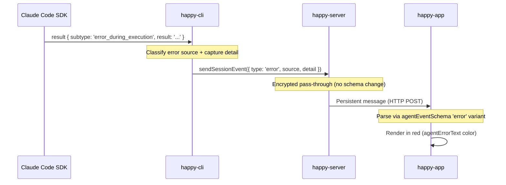

# Error Handling, Classification & Resume Fallback

## Overview

This document covers the error event system that carries CLI errors through the full stack (CLI -> Server -> App) with source classification, detailed error messages, and visual differentiation. It also documents the resume fallback mechanism that prevents infinite retry loops when `--resume` targets a non-existent session.

**Problem solved:**
1. All CLI errors reported as generic "Process exited unexpectedly" — no detail, no source classification
2. `--resume <sessionId>` fails silently when JSONL doesn't exist, causing infinite retry loop
3. App restart errors shown only in truncated modal, not in persistent chat history

---

## Architecture: Error Event Flow



### Error Source Classification

| Source | Meaning | Detection |
|--------|---------|-----------|
| `claude` | Claude Code SDK / process error | `SDKResultMessage.subtype === 'error_during_execution'` or error message contains "Claude Code process exited" |
| `codex` | Codex provider error | Reserved for codex-specific errors (same pattern) |
| `happy` | Happy CLI internal error | Default — any error not matched by claude/codex patterns |

---

## Implementation Details

### 1. CLI: Error Event Type

**File:** `packages/happy-cli/src/api/apiSession.ts`

`sendSessionEvent` union type extended with:

```typescript
| { type: 'error', source: 'happy' | 'claude' | 'codex', detail: string }
```

This event travels through the **persistent pipeline** (encrypted HTTP POST), not ephemeral socket — error events are part of permanent session history.

### 2. CLI: Error Capture in Remote Launcher

**File:** `packages/happy-cli/src/claude/claudeRemoteLauncher.ts`

Two-phase error capture:

**Phase 1 — Track SDK error results in `onMessage`:**

```
onMessage(message)
  └─ if message.type === 'result' && subtype === 'error_during_execution'
     └─ lastError.result = { subtype, detail: message.result }
```

Uses a mutable wrapper object (`lastError: { result: ... | null }`) to avoid TypeScript control flow narrowing `let` variables to `never` in catch blocks — TS doesn't track cross-closure mutations.

**Phase 2 — Classify and send in catch block:**

```
catch (e)
  ├─ errorMessage = e.message
  ├─ if lastError.result?.detail → source='claude', detail=SDK error string
  ├─ elif errorMessage includes 'Claude Code process exited' → source='claude'
  ├─ else → source='happy'
  ├─ sendSessionEvent({ type: 'error', source, detail })
  ├─ consumeOneTimeFlags()  ← resume fallback
  └─ lastError.result = null
```

**Key change**: `consumeOneTimeFlags()` is now called on the error path (previously only on success). This strips `--resume` args, preventing infinite retry with a bad session ID.

### 3. CLI: Same Fix in Local Launcher

**File:** `packages/happy-cli/src/claude/claudeLocalLauncher.ts`

The non-`ExitCodeError` catch path uses the same pattern:

```typescript
const errorMessage = e instanceof Error ? e.message : String(e);
session.client.sendSessionEvent({ type: 'error', source: 'claude', detail: errorMessage });
session.consumeOneTimeFlags();
```

### 4. App: Error Event Schema

**File:** `packages/happy-app/sources/sync/typesRaw.ts`

```typescript
const agentEventSchema = z.discriminatedUnion('type', [
    // ... existing variants ...
    z.object({
        type: z.literal('error'),
        source: z.enum(['happy', 'claude', 'codex']),
        detail: z.string(),
    }),
]);
```

### 5. App: Error Event Rendering

**File:** `packages/happy-app/sources/components/MessageView.tsx`

`AgentEventBlock` renders `error` events with distinct red styling:

```tsx
if (props.event.type === 'error') {
    return (
        <View style={styles.agentErrorContainer}>
            <Text style={styles.agentErrorText}>{props.event.detail}</Text>
        </View>
    );
}
```

Theme colors:
| Theme | Color | Value |
|-------|-------|-------|
| Light | `agentErrorText` | `#FF3B30` |
| Dark | `agentErrorText` | `#FF6B6B` |

Error text is rendered **untruncated** — the full detail string appears in the chat, unlike the modal which had limited display capacity.

### 6. App: Local Event Injection

**File:** `packages/happy-app/sources/sync/sync.ts`

New public method for app-originated events (not from server):

```typescript
injectLocalEvent(sessionId: string, event: AgentEvent): void
```

Creates a `NormalizedMessage` with `role: 'event'` and enqueues it locally via `enqueueMessages()`. No server round-trip. Used by `useSessionQuickActions.ts` to inject restart errors into the session chat alongside the existing modal display.

---

## Resume Fallback Mechanism

### Problem

When the app restarts a session, the daemon passes `--resume <claudeSessionId>` to the new CLI process. If the JSONL file for that session ID doesn't exist (e.g., session was archived, file was deleted, or different machine):

1. `claudeRemote` extracts `--resume` from `claudeArgs`
2. `claudeCheckSession()` returns false (file not found)
3. SDK attempts to resume anyway via `startFrom`
4. SDK returns `error_during_execution: "No conversation found with session ID: ..."`
5. Error propagates to catch block
6. **Before fix**: Generic "Process exited unexpectedly" sent, `consumeOneTimeFlags()` NOT called → `--resume` flag persists → infinite retry loop
7. **After fix**: Detailed error sent, `consumeOneTimeFlags()` strips `--resume` flag → next iteration starts fresh session

### Flow After Fix

```
Iteration 1 (with --resume):
  claudeRemote({ claudeArgs: ['--resume', 'cd4f58a1-...'] })
    ├─ claudeCheckSession('cd4f58a1-...') → false (JSONL missing)
    ├─ Extract --resume from claudeArgs → startFrom = 'cd4f58a1-...'
    ├─ SDK query → error_during_execution: "No conversation found"
    ├─ Error propagates to catch block
    ├─ sendSessionEvent({ type: 'error', source: 'claude', detail: 'No conversation found...' })
    └─ consumeOneTimeFlags() → strips --resume from claudeArgs

Iteration 2 (fresh session):
  claudeRemote({ claudeArgs: [] })
    ├─ No --resume in claudeArgs
    ├─ startFrom = null
    ├─ SDK starts fresh session in same project directory
    └─ Session continues normally
```

### `consumeOneTimeFlags()` Behavior

**File:** `packages/happy-cli/src/claude/session.ts`

Removes `--resume` and its argument from `session.claudeArgs`. These flags are "one-time" — they should only apply to the first spawn attempt. After consumption:
- `claudeArgs` no longer contains `--resume`
- Next loop iteration calls SDK without resume, starting a fresh conversation
- The Happy session ID is preserved (same encryption key, same chat history)

---

## Error Classification Reference

### Common Error Patterns

| Error | Source | Detail Example |
|-------|--------|---------------|
| Session JSONL missing | `claude` | `No conversation found with session ID: cd4f58a1-...` |
| Process exit non-zero | `claude` | `Claude Code process exited with code 1` |
| Spawn failure | `claude` | `Failed to spawn Claude Code process: ENOENT` |
| SDK timeout | `claude` | SDK-specific timeout message |
| Happy internal error | `happy` | Error message from Happy code |

### Files Modified

| File | Change |
|------|--------|
| `packages/happy-cli/src/api/apiSession.ts` | Added `error` event type to `sendSessionEvent` |
| `packages/happy-cli/src/claude/claudeRemoteLauncher.ts` | Error classification, SDK result tracking, `consumeOneTimeFlags()` on error |
| `packages/happy-cli/src/claude/claudeLocalLauncher.ts` | Same error classification + `consumeOneTimeFlags()` |
| `packages/happy-app/sources/sync/typesRaw.ts` | Added `error` variant to `agentEventSchema` |
| `packages/happy-app/sources/theme.ts` | Added `agentErrorText` colors (light/dark) |
| `packages/happy-app/sources/components/MessageView.tsx` | Error event rendering with red styling |
| `packages/happy-app/sources/sync/sync.ts` | Added `injectLocalEvent()` method |
| `packages/happy-app/sources/hooks/useSessionQuickActions.ts` | Restart errors injected into chat |
